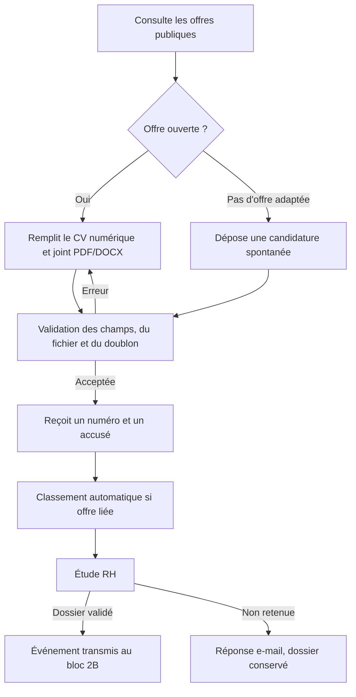
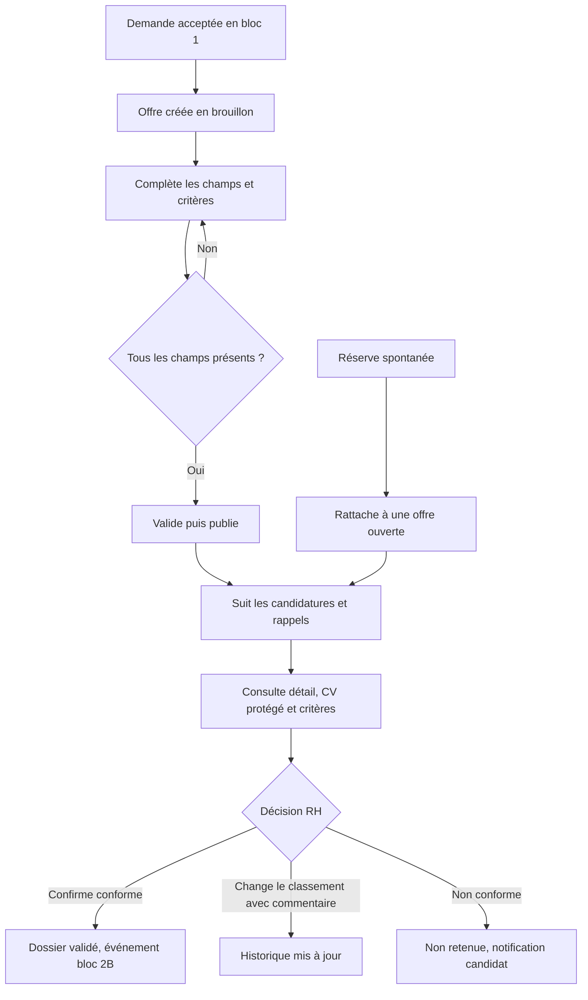

# Flux utilisateur — Bloc 2A

## Candidat

```mermaid
flowchart TD
  A[Consulte les offres publiques] --> B{Offre ouverte ?}
  B -->|Oui| C[Remplit le CV numérique et joint PDF/DOCX]
  B -->|Pas d'offre adaptée| C2[Dépose une candidature spontanée]
  C --> D[Validation des champs, du fichier et du doublon]
  C2 --> D
  D -->|Erreur| C
  D -->|Acceptée| E[Reçoit un numéro et un accusé]
  E --> F[Classement automatique si offre liée]
  F --> G[Étude RH]
  G -->|Dossier validé| H[Événement transmis au bloc 2B]
  G -->|Non retenue| I[Réponse e-mail, dossier conservé]
```

## RH

```mermaid
flowchart TD
  A[Demande acceptée en bloc 1] --> B[Offre créée en brouillon]
  B --> C[Complète les champs et critères]
  C --> D{Tous les champs présents ?}
  D -->|Non| C
  D -->|Oui| E[Valide puis publie]
  E --> F[Suit les candidatures et rappels]
  F --> G[Consulte détail, CV protégé et critères]
  G --> H{Décision RH}
  H -->|Confirme conforme| I[Dossier validé, événement bloc 2B]
  H -->|Change le classement avec commentaire| J[Historique mis à jour]
  H -->|Non conforme| K[Non retenue, notification candidat]
  L[Réserve spontanée] --> M[Rattache à une offre ouverte]
  M --> F
```
